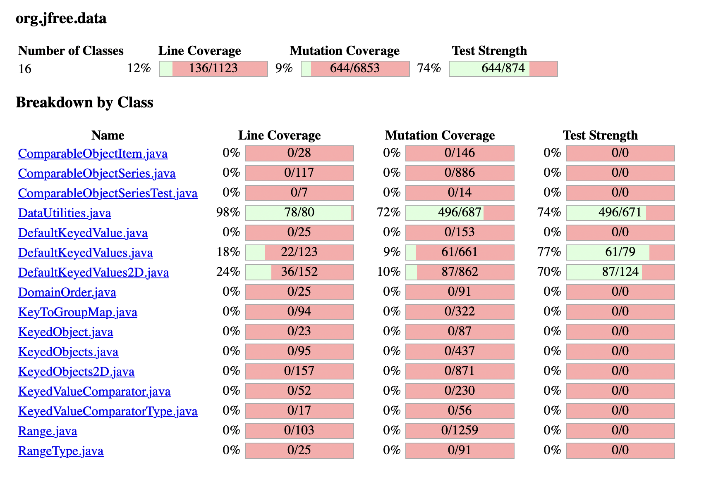
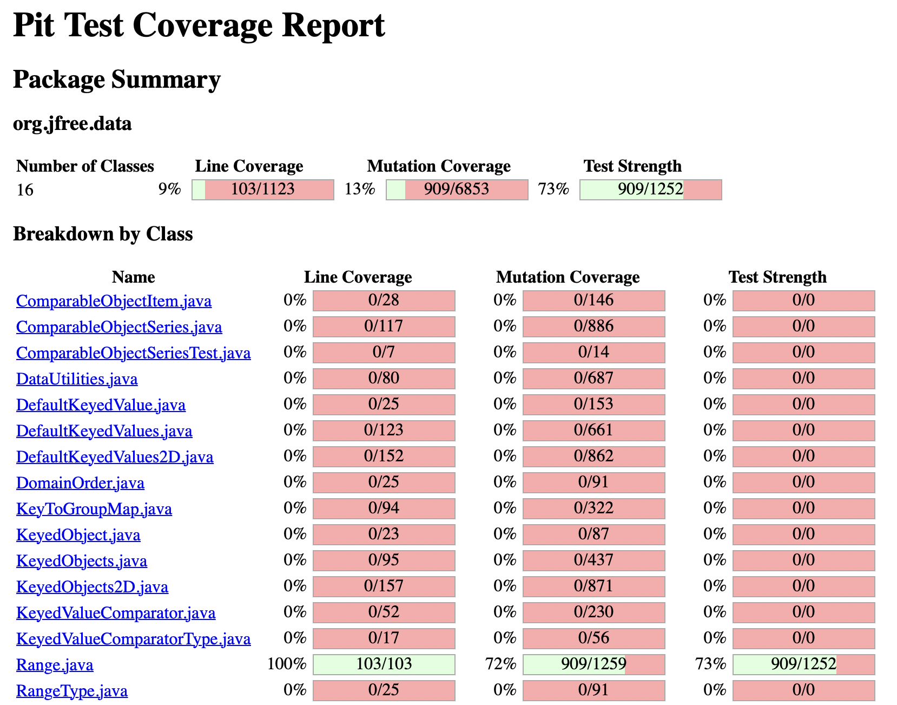

# SENG 438 - Software Testing, Reliability, and Quality

## Lab. Report \#4 – Mutation Testing and Web App Testing

| Group \#: 3    |
| -------------- |
| Aaron Frerichs |
| Avijot Gern    |
| Jesse Gerbrandt|
| Ethan Subasic  |

## Introduction

This lab focused on both Mutation Testing and GUI Testing. Throughout the Mutation Testing portion of this lab, the same Range and DataUtilities tests from the previous labs were used. In this iteration of testing, Pitest was used as a mutation testing software in order to examine the amount of mutants that our test code were able to kill. Through this analysis, we were able to make improvements to our previous code, increasing the robustness of our tests. In the GUI Testing section of this lab, the Selenium IDE was used to create scripts to test the IKEA website. Several tests were formulated in order to test basic functionalities of the website.

## Analysis of 10 Mutants of the Range class 

### **Mutant 1**

**Line:** 217 in ```combine()``` method <br/>
**Orignial Code:** ```if (range1 == null)```<br/>
**Mutated Code:** ```if (false)```<br/>
**Summary:** Mutant was <span style="color:green"><u>killed</u></span> by the test ```firstRangeNullShouldReturnRangeTwo()``` as we expected the returned range to be the same as the second input range but instead an unexpected value was recieved since the mutant code was using unexpected values for the max and min in lines 223 andd 224 which caused unexpected behaviour.<br/>

### **Mutant 2**

**Line:** 221 in ```combine()``` method <br/>
**Orignial Code:** ```return range1```<br/>
**Mutated Code:** ```return null```<br/>
**Summary:** Mutant was <span style="color:green"><u>killed</u> </span> by the test ```secondRangeNullShouldReturnRangeOne()``` as we expected the returned range to be the same as the first input range, since the second one from the test is null. The return value from the mutated code was null instead which was not expected from our test and was thus killed.<br/>

### **Mutant 3**

**Line:** 190 in ```constrain()``` method <br/>
**Orignial Code:** ```if (value > this.upper)```<br/>
**Mutated Code:** ```if (value >= this.upper)```<br/>
**Summary:** The mutant <span style="color:red"><u>survived</u></span>, this is because there are no tests in RangeTest that was used it check if the ```value``` argument is equal to the upper range value of the range its being used on.<br/>

### **Mutant 4**

**Line:** 132 in ```getCentralValue()``` method <br/>
**Orignial Code:** ```return this.lower / 2.0 + this.upper / 2.0```<br/>
**Mutated Code:** ```return this.lower / 1.0 + this.upper / 2.0```<br/>
**Summary:** The mutant was <span style="color:green"><u>killed</u></span>. Both of the tests made for this method, ```centerValueShouldBe0()``` and ```centerValueShouldBe0point5()``` were able to kill this mutation as the lower bound was no longer being haved so the center would have been offset from the expected center in both cases.<br/>

### **Mutant 5**

**Line:** 132 in ```getCentralValue()``` method <br/>
**Orignial Code:** ```return this.lower / 2.0 + this.upper / 2.0```<br/>
**Mutated Code:** ```return (this.lower)++ / 2.0 + this.upper / 2.0```<br/>
**Summary:** The mutant <span style="color:red"><u>survived</u></span>. This mutant was missed by the tests because it does not cause any damage. Since the incrementation succeeds the variable, it will only be applied once the variable is already used in the equation, and since the equation is done in the return line the lower will not cause any immediate damage in this method. However this could become an issue in the future if more opetations are enacted on the same range as now the lower field will have been altered.<br/>

### **Mutant 6**

**Line:** 157 in ```intersects()``` method <br/>
**Orignial Code:** ```if (b0 <= this.lower)```<br/>
**Mutated Code:** ```if (b0 < this.lower)```<br/>
**Summary:** The mutant <span style="color:red"><u>survived</u></span>. This mutant was able to survive since none of the tests working with this method tested arguments that were the same as ,in this case, the lower value of the range the method is being done on.<br/>

### **Mutant 7**

**Line:** 161 in ```intersects()``` method <br/>
**Orignial Code:** ```return (b0 < this.upper && b1 >= b0)```<br/>
**Mutated Code:** ```return (b0 <= this.upper && b1 >= b0)```<br/>
**Summary:** The mutant <span style="color:red"><u>survived</u></span>. Similar to mutation 6, this mutant code was not detected since none of the tests for the intersets method use arguments that are equivalent to the upper value of the range being used. <br/>

### **Mutant 8**

**Line:** 123 in ```getLength()``` method <br/>
**Orignial Code:** ```return this.upper - this.lower```<br/>
**Mutated Code:** ```return this.upper + this.lower```<br/>
**Summary:** The mutant was <span style="color:green"><u>killed</u></span>. The mutant was detected and killed by the test ```theLengthValueShouldBeTwo()``` since the original math of 1 - (-1) would have returned the expected value or 2, and the changed math 1 + (-1) returned an unexpected value 0.<br/>

### **Mutant 9**

**Line:** 425 in ```equals()``` method <br/>
**Orignial Code:** ```if (!(obj instanceof Range))```<br/>
**Mutated Code:** ```if (true)```<br/>
**Summary:** The mutant was <span style="color:green"><u>killed</u></span>. The test ```rangesAreEqual()``` detected and killed the mutation since a argument of type Range.class was sent to the equals method. In the regular code this resulted in a check to see if the argument's lower and upper bounds were equivalent to the 'this' range. For this test, the check should return true, but with the mutant code it would automatically always return false which is the unexpected behaviour that was detected.<br/>

### **Mutant 10**

**Line:** 448 in ```isNaNRange()``` method <br/>
**Orignial Code:** ```return Double.isNaN(this.lower) && Double.isNaN(this.upper)```<br/>
**Mutated Code:** ```return Double.isNaN(-(this.lower)) && Double.isNaN(this.upper)```<br/>
**Summary:** The mutant <span style="color:red"><u>survived</u></span>. None of the tests for the isNaNRange() method are able to detect this mutation since the negation does not affect the overall boolean being returned. If the value of this.lower is already NaN, the negation will result in a NaN value, so nothing changes. If the value of this.lower is instead a double, the negation will simply result in a different double. This means that in either case the Double.isNaN() method will result the same boolean even after the negation. This means the method isNaNRange() is still acting as expected.<br/>

## Report all the statistics and the mutation score for each test class




## Analysis drawn on the effectiveness of each of the test classes

The final mutation score for Range.java was 72 percent and DataUtilities.java was 72 percent as well. This shows that our test suite is pretty effective and high quality although there still can be work done to improve this score further. 

Looking at the surviving mutants there are definately areas that have obvious issues and by adding a few more tests with more time we could have covered them. There are however some mutants that probably would not have been covered due to equivalent mutants preventing full 100 percent coverage.

Overall our testsuite is pretty robust and effective.

## A discussion on the effect of equivalent mutants on mutation score accuracy

## A discussion of what could have been done to improve the mutation score of the test suites

There are a few ways that mutants are killed depending on the mutant. Since in assignment 3 we focused heavily on ensuring that the coverage of the code was sufficient, we were able to kill many of the mutants before adding any tests to the test suite.<br/>
When we ran the Pitest mutation software we noticed many of the mutations that survived were equivalent mutations and thus were not an issue to the software. However the remaining mutants that survived often came from condtions and math mutations. To ensure that in the future the mutations were killed we added test cases made to specifically target mutants that survived. For instance many were the result of missing condtion checking so we were able to repeat nearly identical tests with just a slight variation of some of the inputs. 

## Why do we need mutation testing? Advantages and disadvantages of mutation testing

Mutation testing is used to evaluate the effectiveness of existing test cases. It involves creating small, artificial changes to the system under test and then running the existing test suite to see if any of the mutations cause the tests to fail. The goal of mutation testing is to identify weaknesses in the test suite and to improve the quality of the testing process.

## Advantages:

Increases confidence that the test suite is correct.

Improves test coverage by exposing areas of the code that are not adequetly covered.

Better understanding of the code by highlighting areas that are difficult to test and susceptible to defects.

## Disadvantages:

Time consuming. There are hundreds of mutants being injected to each file so covering all of them is a long and difficult process.

Lots of false positives. Some mutations wont cause any issues to the code so it leads to lots of false positives.

## Explain your SELENUIM test case design process

For our test case design process, we wanted to give each group member a chance to play with the Selenium IDE, so long as they tested 2 major functionalities of the website. We chose to test the IKEA website (https://www.ikea.com/) and some of the targeted functionality included Logging in, Adding to cart, adding to wishlist, and searching for products (alongside some others). Although each group member was allowed to explore the Selenium IDE freely, they were still tasked to functionality that would be utilized most by common users of the website. The follow table shows a list of the test cases as they appear on Selenium (in the submitted .SIDE files) alongside the group member who performed the respective tests. 

| Group Member | Test Case Name                            |
| ------------ | ----------------------------------------- |
| Ethan        | TC#1: Adding to and Viewing Wish List     |
| Ethan        | TC#2: Change Language to French           |
| Jesse        | TC#3: Adding Items to Cart                |
| Jesse        | TC#4: Category Browsing                   |
| Aaron        | TC#5: Login                               |
| Aaron        | TC#6: Search Item                         |
| Avijot       | TC#7: Creating/Adding to Custom Wish List |
| Avijot       | TC#8: Removing From Shopping Cart         |

## Explain the use of assertions and checkpoints

The purpose of using assertions and checkpoints during testing in SELENIUM IDE is to ensure we have an automated way to test the functionality. Assertions/Checkpoints can act as "Verification points" at which the IDE will test a specific condition, if the condition fails, the test will fail. Some points where we used assertions included checking whether or not a specific value existed on the page, or whether a text field was indeed editable. By using these features of the IDE, we were able to automate our testing further in that we could rely on the IDE to let us know when the test failed, and exactly what caused the failure. Checkpoints, like assertions, are essentially "true or false" checkers, however checkpoints are more specific in the fact that they compare specific values. For example, our "Change Language to French" test, we were able to comapre the "Select Store" button and see if it did indeed change to french ("Choisir un magasin"). These can prove to be especially useful when it comes to UI testing with SELENIUM as you can simple record the steps for a test, and add an asserrtion mid recording, this will now behave as an automated assertion or checkpoint whenever the test is re-run.

## How did you test each functionaity with different test data

During our GUI testing, there were not too many data inputs that could be examined through testing. However, one that was was tested was Valid vs Invalid User Login. One test case attempted to log in a pre-made user, while the other input invalid values in to the fields. As expected, the invalid input tests failed while the valid input passed. Additionally, the "search bar" test has the ability to easily get its value swapped within the script. In our testing on the IKEA website, a "lamp" search was executed, and then an assertion was made to ensure that the search executed. Within the script, changing the "lamp" value to any other value would be able to count as a change in input test data. 

## Discuss advantages and disadvantages of Selenium vs. Sikulix

Selenium and Sikulix were both analyzed during the duration of this lab. Selenium was the perferred choice and was used for all the tests developed for the GUI. Selenium was a chrome-extension IDE which was able to record a users actions and transform the actions in to a sequence of events. Assertions could be placed within these events in order to pass or fail the tests developed. Sikulix is an IDE which adds extensions to various languages such as Java and Python. These scripts have to be manually written using Sikulix to examine the web page. The various pros and cons of the two IDEs can be seen below.

Selenium:
| Pros | Cons|
| ------------ | ----------------------------------------- |
| Easy to use with action recording | Website often times out when recording actions     |
| No understand of webpage functionality or HTML required | Past actions (Eg. Adding item to cart) needs to be manually undone if not directly tested           |
| Chrome extension allows easy installation and use | Inability to combine scripts from multiple files               |
| Ability to export script to different configurations ||

Sikulix:
|Pros|Cons|
|--|--|
|Fine grained control over test execution|External IDE Download|
|No limitations from website (Eg. timing out)|HTML and Website knowledge required|
|Tests can be made in various languages|Tests may take more time and effort to create|

## How the team work/effort was divided and managed

In this lab, we yet again implemented pair programming in order to ensure that everyone got a chance to look through everything. Ethan and Avi were in a pair where Ethan took charge on the Mutation tests and Avi led on the SELENIUM tests. Jesse and Aaron were the other pair and in the same way, Jesse led on the Mutation tests whereas Aaron spearheaded the SELENIUM tests.

## Difficulties encountered, challenges overcome, and lessons learned

Selenium IDE is a powerful tool for automating web application testing, but it can also present some significant challenges. One of the biggest obstacles that we would often encounter was that the IDE would crash unexpectedly, causing frustration and delays in the testing process. One simple test case would take up to 2 hours since the program would crash the website with every run, this led to a lot of "debugging" (restarting the program) and a lot of unresolved issues still up tp the night before the demo. 

## Comments/feedback on the lab itself

Overall we felt that this lab was informative on the advantages and disadvantages of mutation testing, as well as getting to understand UI testing. The instructions in the lab could be a little bit better presented as setting up the project was quite difficult.